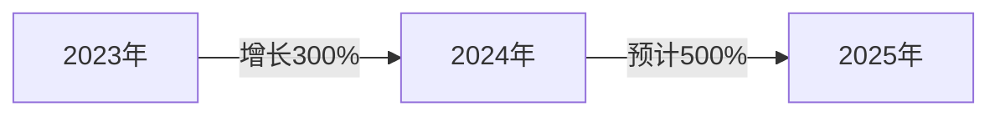
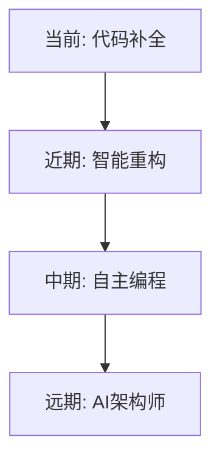

# AI 编辑器调研报告

## 🚀 市面主流AI编辑器深度评测

<div class="pt-12">
  <span @click="$slidev.nav.next" class="px-4 py-2 rounded cursor-pointer bg-white bg-opacity-10 hover:bg-opacity-20">
    开始探索 <carbon:arrow-right class="inline"/>
  </span>
</div>

<div class="abs-br m-6 flex gap-2">
  <div class="text-sm opacity-50">2025年AI辅助编程工具调研</div>
</div>

<style>
/* 覆盖首页标题的紫色渐变，改为更协调的颜色 */
.slidev-layout h1 {
  background: linear-gradient(135deg, #667eea 0%, #764ba2 25%, #f093fb 50%, #815ba9 75%, #fda085 100%);
  background-clip: text;
  -webkit-background-clip: text;
  -webkit-text-fill-color: transparent;
  font-weight: 800;
  text-shadow: 0 10px 40px rgba(0, 0, 0, 0.3);
}

.slidev-layout h2 {
  color: rgba(255, 255, 255, 0.95);
  text-shadow: 0 2px 10px rgba(0, 0, 0, 0.5);
}
</style>

---

# 介绍与目标

## 🎯 本次调研目的

<div v-click>

### 调研背景
- AI编程辅助工具爆发式增长
- 开发者需求日益增加  
- 工具选择困难

</div>

<div v-click>

### 调研目标
- 🔍 **全面评测** - 对比市面主流AI编辑器
- 📊 **数据分析** - 提供客观的性能和体验评估
- 💡 **选型建议** - 为不同场景提供最佳实践
- 🚀 **趋势预测** - 探索AI编程未来发展方向

</div>

---

# 市场概览

## 📈 AI编辑器市场现状

<div class="grid grid-cols-2 gap-6">

<div v-click>

### 市场规模


</div>

<div v-click>

### 主要玩家
- **独立编辑器**: Cursor, Warp, Trae
- **插件类**: Copilot, Cline, Augment
- **终端类**: Claude Code, Gemini CLI
- **新兴力量**: Kiro, Codex

</div>

</div>

<div v-click class="mt-6 text-sm">

### 💰 市场投资热度
- 2024年融资总额超过 **$10亿** | Cursor估值达到 **$4亿** | GitHub Copilot用户超过 **100万**

</div>

---

# 对比维度说明

## 📊 评测维度设计

<div class="grid grid-cols-2 gap-6 mt-4">

<div>

### 技术能力
- ⭐ **代码质量** - 生成代码准确性
- ⭐ **智能程度** - AI上下文理解
- ⭐ **响应速度** - 代码建议实时性
- ⭐ **多语言支持** - 编程语言覆盖

</div>

<div>

### 用户体验
- 👤 **使用难度** - 学习曲线
- 💰 **费用成本** - 订阅价格
- 📈 **增效比例** - 效率提升
- 🔧 **集成能力** - 工具链兼容

</div>

</div>

<div v-click class="mt-6 p-3 bg-blue-500/10 rounded text-sm">

### 🎯 评分标准
每个维度采用 **五星评分制** ，综合用户反馈和实测数据得出

</div>

---

# Cursor

## ✨ AI原生编辑器先锋

<div class="grid grid-cols-2 gap-8 mt-4">

<div>

### 核心优势
- 🚀 **Tab补全业界第一**
- 🧠 智能上下文理解
- 🎨 优雅的UI设计

### 评分数据
- **代码质量**: ⭐⭐⭐⭐
- **智能程度**: ⭐⭐⭐⭐
- **使用难度**: ⭐ (极易上手)
- **增效比例**: **50%**
- **费用**: $20/月

</div>

<div>


<div class="p-3 bg-green-500/10 rounded text-sm">

**用户评价**: 
"Tab补全功能改变了我的编码方式，但内存占用确实有点高"

</div>

</div>

</div>

---

# Claude Code

## 🤖 强大的终端AI助手

<div class="grid grid-cols-2 gap-8 mt-4">

<div>

### 核心优势
- 💪 **基于Claude 3.5模型**
- 🔍 深度代码理解
- 📝 优秀的文档生成

### 评分数据
- **代码质量**: ⭐⭐⭐⭐
- **智能程度**: ⭐⭐⭐⭐
- **使用难度**: ⭐⭐
- **增效比例**: **45%**
- **费用**: $25/月

</div>

<div>


<div class="p-3 bg-yellow-500/10 rounded text-sm">

**注意事项**: 
- 价格偏高
- 中转商封号问题严重
- 需要稳定的网络环境

</div>

</div>

</div>

---

# GitHub Copilot

## 🐙 最流行的AI编程助手

<div class="grid grid-cols-2 gap-8 mt-4">

<div>

### 核心优势
- 🌍 **生态系统完善**
- 🔧 VS Code深度集成
- 🆓 学生免费使用

### 评分数据
- **代码质量**: ⭐⭐⭐⭐
- **智能程度**: ⭐⭐⭐⭐
- **使用难度**: ⭐ (即插即用)
- **性价比**: ⭐⭐⭐⭐⭐
- **费用**: $10/月 (学生免费)

</div>

<div>


<div class="p-3 bg-purple-500/10 rounded text-sm">

**特别优势**: 
- 学生认证后完全免费
- 与GitHub深度集成
- 社区支持活跃

</div>

</div>

</div>

---

# Warp

## ⚡ AI超级终端

<div class="grid grid-cols-2 gap-8 mt-4">

<div>

### 核心优势
- 🖥️ **革命性终端体验**
- 🤖 AI命令建议
- 📋 智能历史管理

### 评分数据
- **代码质量**: ⭐⭐⭐⭐
- **智能程度**: ⭐⭐⭐⭐
- **使用难度**: ⭐⭐⭐ (无中文)
- **增效比例**: **40%**
- **费用**: $18/月

</div>

<div>


<div class="p-3 bg-blue-500/10 rounded text-sm">

**独特价值**: 
虽非传统编辑器，但其超级终端体验确实提升开发效率

</div>

</div>

</div>

---

# Trae

## 🎯 精准的AI编码助手

<div class="grid grid-cols-2 gap-8 mt-4">

<div>

### 核心优势
- 🎯 **支持选中元素**
- 💡 对提示词敏感
- 💰 价格实惠

### 评分数据
- **代码质量**: ⭐⭐⭐
- **智能程度**: ⭐⭐⭐
- **使用难度**: ⭐ (简单易用)
- **增效比例**: **35%**
- **费用**: $3/月

</div>

<div>


<div class="p-3 bg-green-500/10 rounded text-sm">

**使用建议**: 
需要使用者理清需求和逻辑，适合有经验的开发者

</div>

</div>

</div>

---

# 关键对比表格

## 📊 综合对比一览

<div class="text-xs">

| 产品 | 类型 | 代码 | 智能 | 难度 | 增效 | 费用 | 推荐 |
|:----:|:----:|:---:|:---:|:---:|:---:|:----:|:---:|
| **Cursor** | 编辑器 | ⭐⭐⭐⭐ | ⭐⭐⭐⭐ | ⭐ | 50% | $20/月 | ⭐⭐⭐⭐⭐ |
| **Claude Code** | 终端 | ⭐⭐⭐⭐ | ⭐⭐⭐⭐ | ⭐⭐ | 45% | $25/月 | ⭐⭐⭐⭐ |
| **Copilot** | 插件 | ⭐⭐⭐⭐ | ⭐⭐⭐⭐ | ⭐ | 40% | $10/月 | ⭐⭐⭐⭐⭐ |
| **Warp** | 终端 | ⭐⭐⭐⭐ | ⭐⭐⭐⭐ | ⭐⭐⭐ | 40% | $18/月 | ⭐⭐⭐⭐ |
| **Trae** | 编辑器 | ⭐⭐⭐ | ⭐⭐⭐ | ⭐ | 35% | $3/月 | ⭐⭐⭐ |
| **Cline** | 插件 | ⭐⭐⭐ | ⭐⭐⭐ | ⭐⭐ | 30% | Token | ⭐⭐⭐ |
| **Gemini** | 终端 | ⭐⭐ | ⭐⭐ | ⭐⭐ | 20% | 免费 | ⭐⭐ |

</div>

---

# 编辑推荐

## 🏆 最佳选择奖

<div class="grid grid-cols-3 gap-4 mt-6">

<div class="p-4 bg-gradient-to-br from-yellow-500/20 to-orange-500/20 rounded-lg">

### 🥇 最佳综合体验
**Cursor**
- Tab补全业界领先
- 智能程度最高
- 开发效率提升50%

</div>

<div class="p-4 bg-gradient-to-br from-green-500/20 to-blue-500/20 rounded-lg">

### 💰 最佳性价比
**GitHub Copilot** (学生)
**Trae** (付费用户)
- Copilot学生免费
- Trae仅需$3/月
- 功能实用性价比高

</div>

<div class="p-4 bg-gradient-to-br from-purple-500/20 to-pink-500/20 rounded-lg">

### 🚀 最佳创新
**Warp**
- 革命性终端体验
- AI命令建议
- 智能历史管理

</div>

</div>

---

# 优缺点总结

## ⚖️ 各工具优劣势分析

<div class="grid grid-cols-2 gap-6 mt-4 text-sm">

<div>

### ✅ 优势总结

**Cursor**
- Tab补全无敌，编码体验极佳

**Copilot**  
- 生态完善，与GitHub深度集成

**Warp**
- 终端体验革命性提升

**Trae**
- 性价比极高，功能实用

</div>

<div>

### ❌ 劣势总结

**Cursor**
- 内存占用较大，机器要求高

**Claude Code**
- 价格偏贵，封号风险高

**Cline**
- 需自配模型，消耗Token快

**Gemini CLI**
- 功能基础，智能程度有限

</div>

</div>

---

# 选型建议

## 🎯 不同场景的最佳选择

<div class="grid grid-cols-2 gap-4 mt-6">

<div class="p-4 bg-gradient-to-br from-blue-500/20 to-cyan-500/20 rounded-lg">

### 👨‍🎓 学生/个人开发者
<div class="mt-2 text-sm">
<div class="font-bold text-cyan-300">GitHub Copilot + Trae</div>
<ul class="mt-2 space-y-1 text-xs">
<li>• Copilot学生免费</li>
<li>• Trae仅需$3/月</li>
<li>• 学习曲线平缓</li>
</ul>
</div>

</div>

<div class="p-4 bg-gradient-to-br from-green-500/20 to-emerald-500/20 rounded-lg">

### 🏢 专业开发团队
<div class="mt-2 text-sm">
<div class="font-bold text-emerald-300">Cursor + Copilot</div>
<ul class="mt-2 space-y-1 text-xs">
<li>• 效率最大化</li>
<li>• 团队协作友好</li>
<li>• 功能全面</li>
</ul>
</div>

</div>

<div class="p-4 bg-gradient-to-br from-purple-500/20 to-pink-500/20 rounded-lg">

### 🚀 全栈开发者
<div class="mt-2 text-sm">
<div class="font-bold text-pink-300">Warp + Cursor</div>
<ul class="mt-2 space-y-1 text-xs">
<li>• 终端编辑器双管齐下</li>
<li>• 全方位效率提升</li>
<li>• 专业级配置</li>
</ul>
</div>

</div>

<div class="p-4 bg-gradient-to-br from-yellow-500/20 to-orange-500/20 rounded-lg">

### 💰 预算有限用户
<div class="mt-2 text-sm">
<div class="font-bold text-orange-300">Gemini CLI + VS Code</div>
<ul class="mt-2 space-y-1 text-xs">
<li>• 完全免费</li>
<li>• 基础功能满足</li>
<li>• 适合入门</li>
</ul>
</div>

</div>

</div>

---

# 未来趋势

## 🔮 AI编程的未来展望

<div class="grid grid-cols-2 gap-6 mt-4">

<div>

### 📈 技术趋势



</div>

<div>

### 🌟 发展预测

- **2025年**: 多模态编程助手普及
- **2026年**: AI自主解决复杂Bug
- **2027年**: 人机协同编程成主流
- **2028年**: AI参与系统架构设计

</div>

</div>

<div v-click class="mt-4 p-3 bg-gradient-to-r from-indigo-500/10 to-purple-500/10 rounded text-sm">

### 💡 行业洞察
**开源化趋势** | **本地化部署** | **定制化服务**

</div>

---

# 个人使用技巧

## 💡 提升AI编程效率的实践经验

<div class="space-y-4 mt-4 text-sm">

<div>

### 1️⃣ 提示词优化
```markdown
❌ "写一个函数"
✅ "写一个TypeScript函数，接收用户数组，返回按年龄排序的结果"
```

</div>

<div>

### 2️⃣ 上下文管理
- 保持代码文件精简，避免超长文件
- 及时清理无用注释和代码
- 使用明确的变量和函数命名

</div>

<div>

### 3️⃣ 工具组合使用


</div>

</div>

---
layout: center
class: text-center
---

# Q&A

## 🤔 提问与讨论

### 感谢观看！

<div class="mt-6 space-y-2 text-sm">
<div>💬 欢迎交流AI编程经验</div>
<div>📧 联系方式：your-email@example.com</div>
<div>🔗 项目地址：github.com/your-repo</div>
</div>

<div class="mt-8">
  <span @click="$slidev.nav.go(1)" class="px-4 py-2 rounded cursor-pointer bg-white bg-opacity-10 hover:bg-opacity-20">
    回到开始 <carbon:arrow-right class="inline"/>
  </span>
</div>
