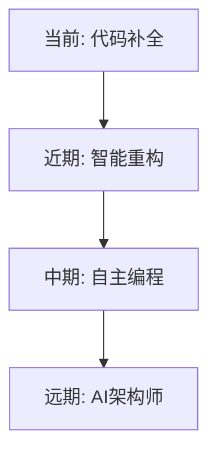

# AI 编辑器调研报告

## 🚀 市面主流AI编辑器深度评测

<div class="pt-12">
  <span @click="$slidev.nav.next" class="px-4 py-2 rounded cursor-pointer bg-white bg-opacity-10 hover:bg-opacity-20">
    开始探索 <carbon:arrow-right class="inline"/>
  </span>
</div>

<div class="abs-br m-6 flex gap-2">
  <div class="text-sm opacity-50">2025年AI辅助编程工具调研</div>
</div>

<!--
封面页：展示报告主题和调研范围
-->

---
transition: fade-out
---

# 介绍与目标

## 🎯 本次调研目的

<div v-click>

### 调研背景
- AI编程辅助工具爆发式增长
- 开发者需求日益增加  
- 工具选择困难

</div>

<div v-click>

### 调研目标
- 🔍 **全面评测** - 对比市面主流AI编辑器
- 📊 **数据分析** - 提供客观的性能和体验评估
- 💡 **选型建议** - 为不同场景提供最佳实践
- 🚀 **趋势预测** - 探索AI编程未来发展方向

</div>

<!--
介绍调研的目标和范围
-->

---
transition: slide-up
---

# 市场概览

## 📈 AI编辑器市场现状

<div class="grid grid-cols-2 gap-8">

<div v-click>

### 市场规模


</div>

<div v-click>

### 主要玩家
- **独立编辑器**: Cursor, Warp, Trae
- **插件类**: Copilot, Cline, Augment
- **终端类**: Claude Code, Gemini CLI
- **新兴力量**: Kiro, Codex

</div>

</div>

<div v-click class="mt-8">

### 💰 市场投资热度
- 2024年融资总额超过 **$10亿**
- Cursor估值达到 **$4亿**
- GitHub Copilot用户超过 **100万**

</div>

---
transition: fade
---

# 对比维度说明

## 📊 评测维度设计

<div class="grid grid-cols-2 gap-8 mt-6">

<div>

### 技术能力
- ⭐ **代码质量** - 生成代码的准确性和优雅度
- ⭐ **智能程度** - AI理解上下文的能力
- ⭐ **响应速度** - 代码建议的实时性
- ⭐ **多语言支持** - 编程语言覆盖范围

</div>

<div>

### 用户体验
- 👤 **使用难度** - 学习曲线和上手成本
- 💰 **费用成本** - 订阅价格和性价比
- 📈 **增效比例** - 实际编码效率提升
- 🔧 **集成能力** - 与现有工具链的兼容性

</div>

</div>

<div v-click class="mt-8 p-4 bg-blue-500/10 rounded-lg">

### 🎯 评分标准
每个维度采用 **五星评分制** ，综合用户反馈和实测数据得出

</div>

---
layout: two-cols
---

# Cursor

## ✨ AI原生编辑器先锋


### 核心优势
- 🚀 **Tab补全业界第一**
- 🧠 智能上下文理解
- 🎨 优雅的UI设计

::right::

<div class="ml-8 mt-16">

### 评分卡片

| 维度 | 评分 | 说明 |
|------|------|------|
| 代码质量 | ⭐⭐⭐⭐ | 高质量代码生成 |
| 智能程度 | ⭐⭐⭐⭐ | 强大的上下文理解 |
| 使用难度 | ⭐ | 极易上手 |
| 增效比例 | **50%** | 显著提升效率 |

<div v-click class="mt-6 p-4 bg-green-500/10 rounded">

### 💬 用户评价
> "Tab补全功能改变了我的编码方式，但内存占用确实有点高"

</div>

</div>

---
layout: two-cols
---

# Claude Code

## 🤖 强大的终端AI助手


### 核心优势
- 💪 **基于Claude 3.5模型**
- 🔍 深度代码理解
- 📝 优秀的文档生成

::right::

<div class="ml-8 mt-16">

### 评分卡片

| 维度 | 评分 | 说明 |
|------|------|------|
| 代码质量 | ⭐⭐⭐⭐ | 高质量输出 |
| 智能程度 | ⭐⭐⭐⭐ | 强大的AI能力 |
| 使用难度 | ⭐⭐ | 终端操作需适应 |
| 费用 | 💰💰 | 相对较贵 |

<div v-click class="mt-6 p-4 bg-yellow-500/10 rounded">

### ⚠️ 注意事项
- 价格偏高
- 中转商封号问题严重
- 需要稳定的网络环境

</div>

</div>

---
layout: two-cols
---

# GitHub Copilot

## 🐙 最流行的AI编程助手


### 核心优势
- 🌍 **生态系统完善**
- 🔧 VS Code深度集成
- 🆓 学生免费使用

::right::

<div class="ml-8 mt-16">

### 评分卡片

| 维度 | 评分 | 说明 |
|------|------|------|
| 代码质量 | ⭐⭐⭐⭐ | 稳定可靠 |
| 智能程度 | ⭐⭐⭐⭐ | 持续优化中 |
| 使用难度 | ⭐ | 即插即用 |
| 性价比 | ⭐⭐⭐⭐⭐ | 免费/优惠多 |

<div v-click class="mt-6 p-4 bg-purple-500/10 rounded">

### 🎓 特别优势
- 学生认证后完全免费
- 与GitHub深度集成
- 社区支持活跃

</div>

</div>

---
layout: two-cols
---

# Warp

## ⚡ AI超级终端


### 核心优势
- 🖥️ **革命性终端体验**
- 🤖 AI命令建议
- 📋 智能历史管理

::right::

<div class="ml-8 mt-16">

### 评分卡片

| 维度 | 评分 | 说明 |
|------|------|------|
| 代码质量 | ⭐⭐⭐⭐ | 命令生成准确 |
| 智能程度 | ⭐⭐⭐⭐ | 智能命令推荐 |
| 使用难度 | ⭐⭐⭐ | 无中文支持 |
| 增效比例 | **40%** | 终端效率提升 |
| 费用 | $18/月 | 中等价位 |

<div v-click class="mt-6 p-4 bg-blue-500/10 rounded">

### 🌟 独特价值
虽非传统编辑器，但其超级终端体验确实提升开发效率

</div>

</div>

---
layout: two-cols  
---

# Trae

## 🎯 精准的AI编码助手


### 核心优势
- 🎯 **支持选中元素**
- 💡 对提示词敏感
- 💰 价格实惠

::right::

<div class="ml-8 mt-16">

### 评分卡片

| 维度 | 评分 | 说明 |
|------|------|------|
| 代码质量 | ⭐⭐⭐ | 良好水准 |
| 智能程度 | ⭐⭐⭐ | 需要清晰提示 |
| 使用难度 | ⭐ | 简单易用 |
| 增效比例 | **35%** | 稳定提升 |
| 费用 | $3/月 | 极具性价比 |

<div v-click class="mt-6 p-4 bg-green-500/10 rounded">

### 💡 使用建议
需要使用者理清需求和逻辑，适合有经验的开发者

</div>

</div>

---
transition: slide-left
---

# 关键对比表格

## 📊 综合对比一览

<div class="overflow-x-auto mt-6">

| 产品 | 类型 | 代码质量 | 智能程度 | 使用难度 | 增效比例 | 费用 | 推荐指数 |
|------|------|----------|----------|----------|----------|------|----------|
| **Cursor** | 编辑器 | ⭐⭐⭐⭐ | ⭐⭐⭐⭐ | ⭐ | 50% | $20/月 | ⭐⭐⭐⭐⭐ |
| **Claude Code** | 终端 | ⭐⭐⭐⭐ | ⭐⭐⭐⭐ | ⭐⭐ | 45% | $25/月 | ⭐⭐⭐⭐ |
| **Copilot** | 插件 | ⭐⭐⭐⭐ | ⭐⭐⭐⭐ | ⭐ | 40% | $10/月 | ⭐⭐⭐⭐⭐ |
| **Warp** | 终端 | ⭐⭐⭐⭐ | ⭐⭐⭐⭐ | ⭐⭐⭐ | 40% | $18/月 | ⭐⭐⭐⭐ |
| **Trae** | 编辑器 | ⭐⭐⭐ | ⭐⭐⭐ | ⭐ | 35% | $3/月 | ⭐⭐⭐ |
| **Cline** | 插件 | ⭐⭐⭐ | ⭐⭐⭐ | ⭐⭐ | 30% | Token | ⭐⭐⭐ |
| **Gemini CLI** | 终端 | ⭐⭐ | ⭐⭐ | ⭐⭐ | 20% | 免费 | ⭐⭐ |

</div>

<div v-click class="mt-6 p-4 bg-gradient-to-r from-purple-500/10 to-pink-500/10 rounded-lg">

### 🏆 编辑推荐
- **最佳综合体验**: Cursor
- **最佳性价比**: GitHub Copilot (学生) / Trae (付费用户)
- **最佳创新**: Warp

</div>

---
transition: fade
---

# 优缺点总结

## ⚖️ 各工具优劣势分析

<div class="grid grid-cols-2 gap-8 mt-6">

<div>

### ✅ 优势总结

<div v-click>

**Cursor**
- Tab补全无敌，编码体验极佳

</div>

<div v-click>

**Copilot**  
- 生态完善，与GitHub深度集成

</div>

<div v-click>

**Warp**
- 终端体验革命性提升

</div>

<div v-click>

**Trae**
- 性价比极高，功能实用

</div>

</div>

<div>

### ❌ 劣势总结

<div v-click>

**Cursor**
- 内存占用较大，机器要求高

</div>

<div v-click>

**Claude Code**
- 价格偏贵，封号风险高

</div>

<div v-click>

**Cline**
- 需自配模型，消耗Token快

</div>

<div v-click>

**Gemini CLI**
- 功能基础，智能程度有限

</div>

</div>

</div>

---
transition: slide-up
---

# 选型建议

## 🎯 不同场景的最佳选择

<div class="space-y-6 mt-6">

<div v-click class="p-4 bg-blue-500/10 rounded-lg">

### 👨‍🎓 学生/个人开发者
**推荐**: GitHub Copilot (免费) + Trae ($3/月)
- 成本低，功能够用
- 学习曲线平缓

</div>

<div v-click class="p-4 bg-green-500/10 rounded-lg">

### 🏢 专业开发团队  
**推荐**: Cursor + GitHub Copilot
- 效率最大化
- 团队协作友好

</div>

<div v-click class="p-4 bg-purple-500/10 rounded-lg">

### 🚀 全栈开发者
**推荐**: Warp + Cursor
- 终端和编辑器双管齐下
- 全方位效率提升

</div>

<div v-click class="p-4 bg-yellow-500/10 rounded-lg">

### 💰 预算有限用户
**推荐**: Gemini CLI (免费) + VS Code插件
- 零成本起步
- 基础功能满足

</div>

</div>

---
transition: fade-out
---

# 未来趋势

## 🔮 AI编程的未来展望

<div class="grid grid-cols-2 gap-8 mt-8">

<div>

### 📈 技术趋势

<div v-click>



</div>

</div>

<div v-click>

### 🌟 发展预测

- **2025年**: 多模态编程助手普及
- **2026年**: AI自主解决复杂Bug
- **2027年**: 人机协同编程成主流
- **2028年**: AI参与系统架构设计

</div>

</div>

<div v-click class="mt-8 p-4 bg-gradient-to-r from-indigo-500/10 to-purple-500/10 rounded-lg">

### 💡 行业洞察
- **开源化趋势**: 更多开源AI编程工具涌现
- **本地化部署**: 企业级本地AI编程助手需求增长
- **定制化服务**: 针对特定领域的AI编程工具细分

</div>

---
transition: slide-left
---

# 个人使用技巧

## 💡 提升AI编程效率的实践经验

<div class="space-y-4 mt-6">

<div v-click>

### 1️⃣ 提示词优化
```markdown
❌ "写一个函数"
✅ "写一个TypeScript函数，接收用户数组，返回按年龄排序的结果"
```

</div>

<div v-click>

### 2️⃣ 上下文管理
- 保持代码文件精简，避免超长文件
- 及时清理无用注释和代码
- 使用明确的变量和函数命名

</div>

<div v-click>

### 3️⃣ 工具组合使用


</div>

<div v-click class="p-4 bg-green-500/10 rounded-lg">

### 🚀 效率提升秘诀
合理组合不同工具的优势，形成个人高效工作流

</div>

</div>

---
layout: center
class: text-center
---

# Q&A

## 🤔 提问与讨论

<div class="mt-12">

### 感谢观看！

<div class="mt-8 space-y-4">
<div>💬 欢迎交流AI编程经验</div>
<div>📧 联系方式：your-email@example.com</div>
<div>🔗 项目地址：github.com/your-repo</div>
</div>

</div>

<div class="mt-12">
  <span @click="$slidev.nav.go(1)" class="px-4 py-2 rounded cursor-pointer bg-white bg-opacity-10 hover:bg-opacity-20">
    回到开始 <carbon:arrow-right class="inline"/>
  </span>
</div>

<!--
结束页：感谢与联系方式
-->
